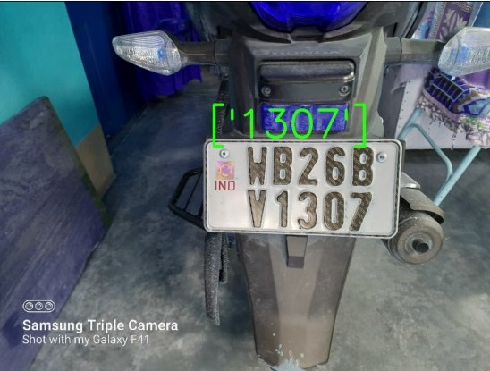

# **Number Plate Detection: using YOLOv8**

In every parking area, a lot of bikes and cars are check in and out. For a secured service, authority needs to maintain a proper log for all vehicles, which is a very bearable work to maintain a logbook in traditional way. Onother case is in roads, vehicles are ran in beyond the speed limits of the roads. Therefore, chances of the accidentents are exponentially increased. It is not possible to deploy traffic controler everewhere on the roads, even, only traffic polices are not enough to prevent the overspeeding. 

### Solution

To maintain a logbook of all vehicles and prevent the overspeeding on the roads, its need to track the vehicle automatically. To track the vehicles, the only way is to track the Licence/Number plate of the vehicle to get all correspondin details.

<!--  -->