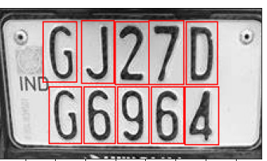
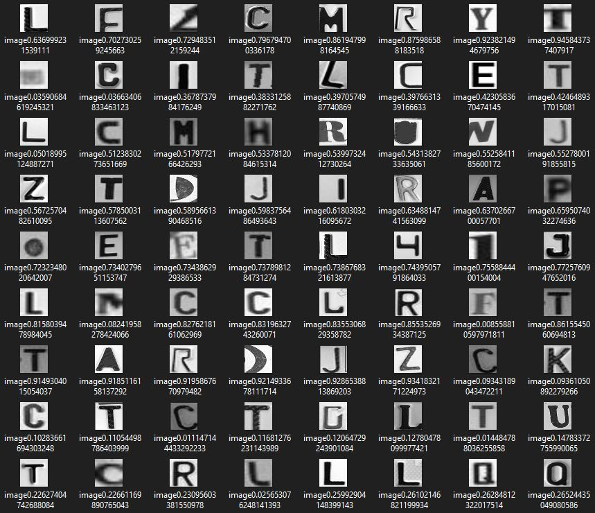

# **Indian License Plate Detection: using YOLOv8**

In every parking area, a lot of bikes and cars are check in and out. For a secured service, authority needs to maintain a proper log for all vehicles, which is a very bearable work to maintain a logbook in traditional way. Another case is in roads, vehicles are ran in beyond the speed limits of the roads. Therefore, chances of the accidents are exponentially increased. It is not possible to deploy traffic controller everywhere on the roads, even, only traffic polices are not enough to prevent the over-speeding. 

## Solution

To maintain a logbook of all vehicles and prevent the over-speeding on the roads, its need to track the vehicle automatically. To track the vehicles, the only way is to track the License/Number plate of the vehicle to get all corresponding details.

<p align="center"></p>


## Dataset

### Plate Detection
Our model is completely focused to detect the Indian vehicles (bikes) license plate detection. There are no suitable image dataset is available on internet to detect, such kind of license plate. So, we used to make a custom dataset, by our own to proceed. We visit several parking zone and clicks thousands of picture of license plates.

After that, we annotated all the images manually in YOLO format.

```
format = ["class_no","bbox_x_value", "bbox_y_value", "bbox_w_value", "bbox_h_value"]
```
We used <a href="https://www.makesense.ai/">makesense.ai</a> to annotate all the images, and generate all the text files for each images, containing annotation value in YOLO format.

After that, prepare the yaml data file to train the model.
``` yaml
path: path_of_main_data_directory
train: path_of_train_images 
val: path_of_validation_images 

nc: 2  #number of classes

# class labelling
names:
  0: Front Plate
  1: Back Plate
```
### Character Detection
Same as License Plate Detection, we use several images, and annotated the characters, generate all the data files and train a ```YOLOv8n``` model to detect only the characters.
<p align="center"></p>

### Character Recognition

<p align="center"></p>


## Methodology
We use ```YOLOv8``` Object detection technique, developed by ```ultyralytics```, to detect the license plate and characters. 

source: <a href="https://github.com/ultralytics/ultralytics/tree/main">Github Repo of Ultralytics</a>


``` bash
pip install ultralytics   
```
Here we used ```YOLOv8n.pt``` model, which comes with pre-trained weights from coco dataset. Therefore we tune this model with our custom dataset, and get the custom weights. These are used to our actual license plate detection. 
